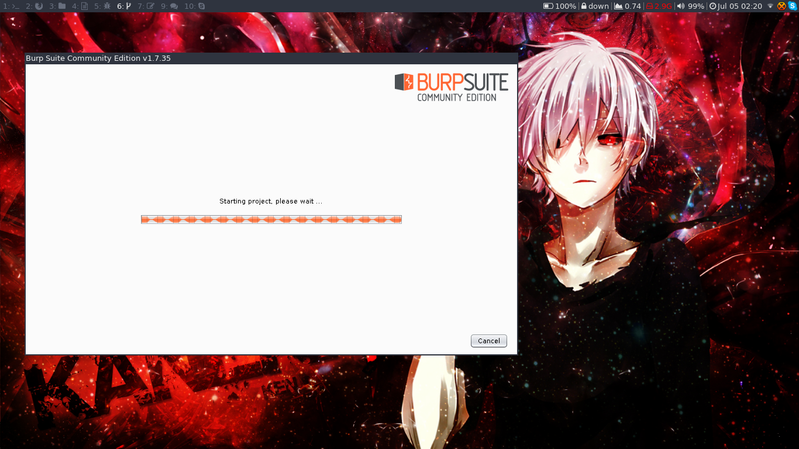

My i3wm config on Kali Linux
-----

### Installs:

- Awesome and Yosemite San-Francisco Fonts
- Moka Icons
- IDA (free)
- Sublime
- Skype
- Libreoffice
- Hexchat
	
### Preview :

### Download KALI Linux i3wm ISO Image

You can get a custom compiled Kali Linux with i3wm and other default Kali tools here --> https://drive.google.com/drive/folders/1BvAvTA_y5CRbBxu-ItYUdJFjnsOkz8LL?usp=sharing

Use the this shared configs for i3wm customization.
